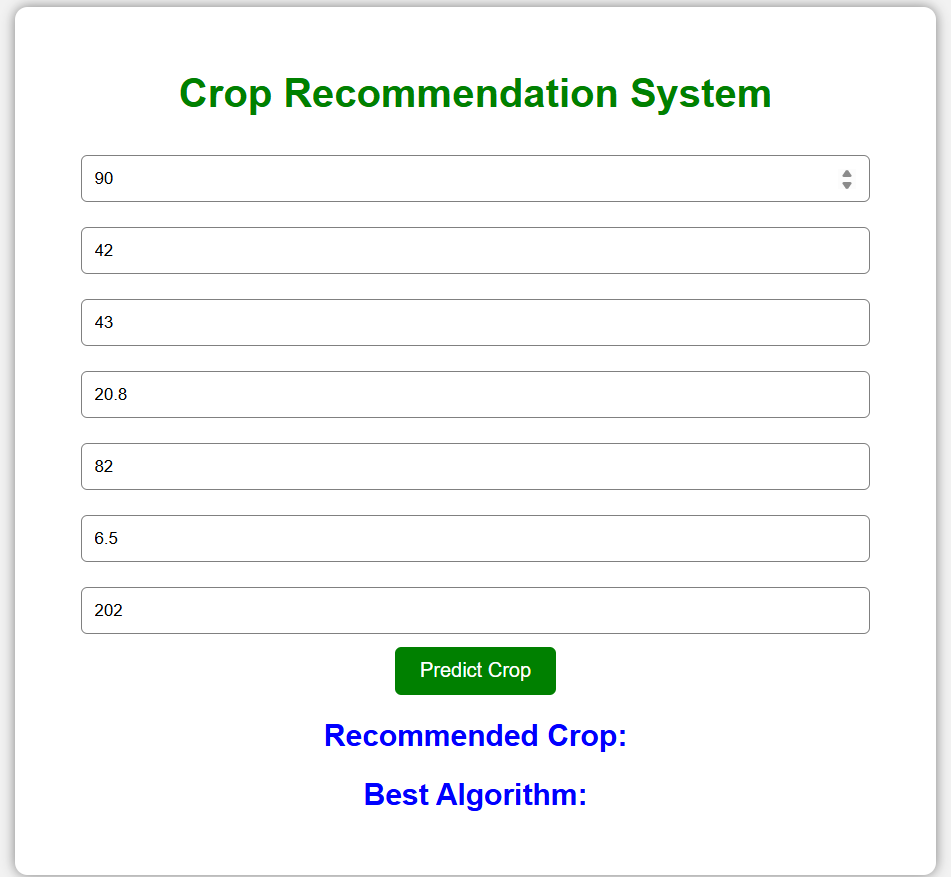
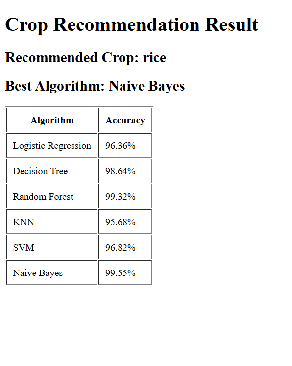

# Crop-Recommendation-System-Using-Machine-Learning-And-Django

## Overview
The Crop Recommendation System is a machine learning-based application developed to recommend the most suitable crop based on soil and environmental conditions. The system analyzes parameters such as Nitrogen, Phosphorus, Potassium (NPK), temperature, humidity, pH, and rainfall to provide accurate crop suggestions for better agricultural productivity.

## Features
- Predicts suitable crops using machine learning algorithms
- Supports multiple environmental and soil parameters
- Performs real-time crop recommendation
- User-friendly prediction interface
- Compares performance of different ML models

## Technologies Used
- Python
- Scikit-learn
- Pandas
- NumPy
- Jupyter Notebook

## Machine Learning Models Used
- Decision Tree
- Random Forest
- Support Vector Machine (SVM)
- Naive Bayes

## Workflow
1. Data Collection and Preprocessing
2. Feature Engineering
3. Model Training and Evaluation
4. Crop Prediction
5. Result Display

## Result
The system successfully predicts suitable crops based on soil nutrient and climatic conditions with high accuracy of 99.57% using Naive Bayes.
## Screenshots

### Input Page

### Prediction Output

## Future Improvements
- Integration with IoT sensors
- Real-time weather API integration
- Mobile application development
- Deep Learning-based recommendation system
